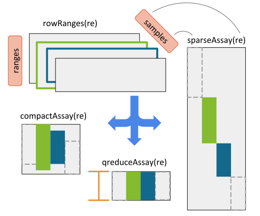

# Introduction

The `r BiocStyle::Biocpkg("RaggedExperiment")` package provides a flexible data
representation for copy number, mutation and other ragged array schema for
genomic location data. It aims to provide a framework for a set of samples
that have differing numbers of genomic ranges.

The `RaggedExperiment` class derives from a `GRangesList` representation and
provides a semblance of a rectangular dataset. The row and column dimensions of
the `RaggedExperiment` correspond to the number of ranges in the entire dataset
and the number of samples represented in the data, respectively.

# Installation

```{r, eval = FALSE}
if (!require("BiocManager"))
    install.packages("BiocManager")
BiocManager::install("RaggedExperiment")
```

Loading the package:

```{r,include=TRUE,results="hide",message=FALSE,warning=FALSE}
library(RaggedExperiment)
library(GenomicRanges)
```

# `RaggedExperiment` class overview

A schematic showing the class geometry and supported transformations of the
`RaggedExperiment` class is show below. There are three main operations for
transforming the `RaggedExperiment` representation:

1) `sparseAssay`
2) `compactAssay`
3) `qreduceAssay`

```{r, echo = FALSE, fig.cap = "RaggedExperiment object schematic. Rows and columns represent genomic ranges and samples, respectively. Assay operations can be performed with (from left to right) compactAssay, qreduceAssay, and sparseAssay.", out.width = "\\maxwidth"}

```

# Constructing a `RaggedExperiment` object

We start with a couple of `GRanges` objects, each representing an individual
sample:

```{r}
sample1 <- GRanges(
    c(A = "chr1:1-10:-", B = "chr1:8-14:+", C = "chr2:15-18:+"),
    score = 3:5)
sample2 <- GRanges(
    c(D = "chr1:1-10:-", E = "chr2:11-18:+"),
    score = 1:2)
```

Include column data `colData` to describe the samples:

```{r}
colDat <- DataFrame(id = 1:2)
```

## Using `GRanges` objects

```{r}
ragexp <- RaggedExperiment(sample1 = sample1,
                           sample2 = sample2,
                           colData = colDat)
ragexp
```

## Using a `GRangesList` instance

```{r}
grl <- GRangesList(sample1 = sample1, sample2 = sample2)
RaggedExperiment(grl, colData = colDat)
```

## Using a `list` of `GRanges`

```{r}
rangeList <- list(sample1 = sample1, sample2 = sample2)
RaggedExperiment(rangeList, colData = colDat)
```

## Using a `List` of `GRanges` with metadata

__Note__: In cases where a `SimpleGenomicRangesList` is provided along with
accompanying metadata (accessed by `mcols`), the metadata is used as the
`colData` for the `RaggedExperiment`.

```{r}
grList <- List(sample1 = sample1, sample2 = sample2)
mcols(grList) <- colDat
RaggedExperiment(grList)
```

# Accessors

## Range data

```{r}
rowRanges(ragexp)
```

## Dimension names

```{r}
dimnames(ragexp)
```

## `colData`

```{r}
colData(ragexp)
```

# Subsetting

## by dimension

Subsetting a `RaggedExperiment` is akin to subsetting a `matrix` object. Rows
correspond to genomic ranges and columns to samples or specimen. It is possible
to subset using `integer`, `character`, and `logical` indices.

## by genomic ranges

The `overlapsAny` and `subsetByOverlaps` functionalities are available for use
for `RaggedExperiment`. Please see the corresponding documentation in
`RaggedExperiment` and `GenomicRanges`.

# *Assay functions

`RaggedExperiment` package provides several different functions for representing
ranged data in a rectangular matrix via the `*Assay` methods.

## sparseAssay

The most straightforward matrix representation of a `RaggedExperiment` will
return a matrix of dimensions equal to the product of the number of ranges and
samples.

```{r}
dim(ragexp)
Reduce(`*`, dim(ragexp))
sparseAssay(ragexp)
length(sparseAssay(ragexp))
```

## compactAssay

Samples with identical ranges are placed in the same row. Non-disjoint ranges
are **not** collapsed.

```{r}
compactAssay(ragexp)
```

## disjoinAssay

This function returns a matrix of disjoint ranges across all samples. Elements
of the matrix are summarized by applying the `simplifyDisjoin` functional
argument to assay values of overlapping ranges.

```{r}
disjoinAssay(ragexp, simplifyDisjoin = mean)
```

## qreduceAssay

The `qreduceAssay` function works with a `query` parameter that highlights
a window of ranges for the resulting matrix. The returned matrix will have
dimensions `length(query)` by `ncol(x)`. Elements contain assay values for the
_i_ th query range and the _j_ th sample, summarized according to the
`simplifyReduce` functional argument.

For demonstration purposes, we can have a look at the original `GRangesList`
and the associated scores from which the current `ragexp` object is derived:

```{r}
unlist(grl, use.names = FALSE)
```

This data is represented as `rowRanges` and `assays` in `RaggedExperiment`:

```{r}
rowRanges(ragexp)
assay(ragexp, "score")
```

Here we provide the "query" region of interest:

```{r}
(query <- GRanges(c("chr1:1-14:-", "chr2:11-18:+")))
```

 The `simplifyReduce` argument in `qreduceAssay` allows the user to summarize
overlapping regions with a custom method for the given "query" region of
interest. We provide one for calculating a weighted average score per
query range, where the weight is proportional to the overlap widths between
overlapping ranges and a query range.

_Note_ that there are three arguments to this function. See the documentation
for additional details.

```{r}
weightedmean <- function(scores, ranges, qranges)
{
    isects <- pintersect(ranges, qranges)
    sum(scores * width(isects)) / sum(width(isects))
}
```

A call to `qreduceAssay` involves the `RaggedExperiment`, the `GRanges` query
and the `simplifyReduce` functional argument.

```{r}
qreduceAssay(ragexp, query, simplifyReduce = weightedmean)
```

See the schematic for a visual representation.
<p style="text-align: right;"> <a href="#header">back to top</a> </p>

# Coercion

The `RaggedExperiment` provides a family of parallel functions for coercing to
the `SummarizedExperiment` class. By selecting a particular assay index (`i`), a
parallel assay coercion method can be achieved.

Here is the list of function names:

* `sparseSummarizedExperiment`
* `compactSummarizedExperiment`
* `disjoinSummarizedExperiment`
* `qreduceSummarizedExperiment`

See the documentation for details.

# Session Information

```{r}
sessionInfo()
```

